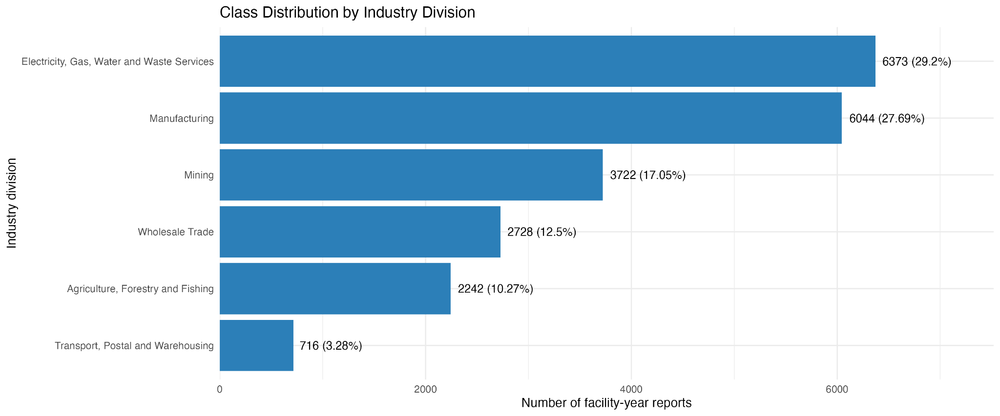
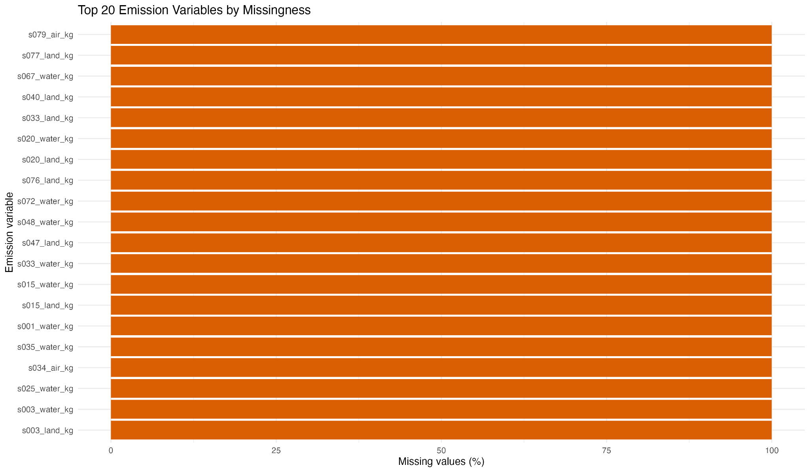
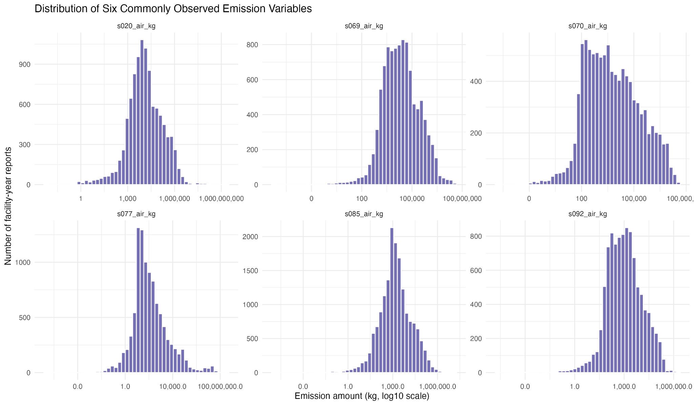
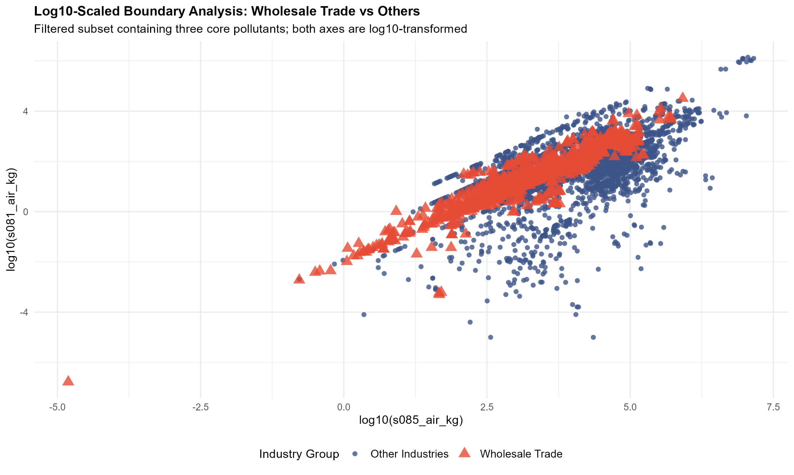

<style>
body { font-size: 11pt; line-height: 1.26; max-width: 980px; }
h1 { font-size: 15pt; margin-top: 0.65em; margin-bottom: 0.28em; }
h2 { font-size: 12pt; margin-top: 0.5em; margin-bottom: 0.22em; }
h3 { font-size: 11.3pt; margin-top: 0.42em; margin-bottom: 0.18em; }
p { margin: 0.18em 0 0.42em; }
table { font-size: 9.4pt; line-height: 1.17; margin: 0.25em 0 0.5em; }
th, td { padding: 3px 5px !important; }
.figure-row { display:flex; gap:10px; align-items:flex-start; margin: 0.25em 0; }
.figure-row img { width:49%; height:auto; }
.figure-single img { width:78%; display:block; margin:0 auto; }
.caption { font-size:9.3pt; text-align:center; margin-top:0.1em; margin-bottom:0.45em; }
.compact td, .compact th { padding:2px 4px !important; }
@media print {
  @page { size: A4; margin: 11mm 12mm; }
  body { font-size: 11pt; line-height:1.2; max-width:none; }
  h1,h2,h3 { page-break-after: avoid; }
  img, table { page-break-inside: avoid; }
  .code-folding-btn { font-size:8pt !important; }
}
</style>

<!-- Added by final integrator to align with the teaching-team template. -->
# Introduction

This project investigates whether annual pollutant emission profiles reported to Australia's National Pollutant Inventory (NPI) contain enough industry-specific information to distinguish six major ANZSIC industry divisions. Using facility-year reports from 2020/2021-2024/2025, the analysis integrates pollutant quantities and reporting patterns, explores class balance, missingness and emission distributions, and uses these findings to guide preprocessing, model selection and evaluation planning.

<!-- Integrated verbatim from Part 1 -->
# Framing & Dataset Selection

## Classification Task

This project examines a multi-class classification problem using annual facility reports from the Australian National Pollutant Inventory (NPI). Each observation corresponds to one reporting facility in one reporting year. The response is derived from the source-recorded primary ANZSIC class code, which is mapped to its corresponding ANZSIC industry division using the official ANZSIC lookup. Predictors are derived mainly from the facility's reported annual pollutant emissions to air, water and land.

## Research Question

*To what extent can annual pollutant emission profiles of Australian NPI-reporting facilities distinguish their primary ANZSIC industry divisions?*

## Motivation & Stakeholders

Industrial activities differ in production processes, materials and resource use, which may be reflected in the types, quantities and environmental media of pollutants reported by facilities. Quantifying how strongly annual emission profiles vary across major ANZSIC divisions can provide a data-driven view of sector-specific pollution patterns in Australia. Government environmental regulators and policymakers may use these patterns to inform monitoring priorities and identify sector-level emission characteristics that warrant closer attention. NPI-reporting facilities and industry organisations may use the results to contextualise their reported emissions, while environmental researchers may use them to investigate differences across sectors.

# Consider & Gather Data

## Data Source

The project uses publicly available National Pollutant Inventory (NPI) data published by the Australian Government Department of Climate Change, Energy, the Environment and Water (DCCEEW, 2026) and distributed through data.gov.au (DCCEEW, n.d.). The official release contains related CSV files for facility reports, emissions, facilities, transfers, substances, ANZSIC classifications and a data dictionary. The core tables for this analysis are `reports.csv`, `emissions.csv`, `substances.csv` and `anzsic-2006.csv`. The analytical dataset was constructed for 2020/2021-2024/2025 by linking these tables through `report_id`, `substance_id` and ANZSIC codes.

## Dataset Justification

```{r dataset-justification-table, echo=TRUE, results='asis'}
criterion <- c(
  "Large",
  "Messy",
  "Complex",
  "Integrated",
  "Multi-class"
)

evidence <- c(
  "After restricting the data to 2020/2021–2024/2025 and six ANZSIC divisions, the integrated cohort contained 22,358 facility-year reports. After excluding 533 reports without emission profiles, the final modelling dataset contains 21,825 observations, still exceeding 10,000. The source <code>emissions.csv</code> contains 1,008,823 pollutant-level rows, so efficient filtering, aggregation and reshaping are needed in R.",
  "In preliminary audit of the matched emission records, water- and land-emission fields were missing or unreported in about 92.3% and 88.0% of rows, respectively. Because some non-reporting may be structural rather than data error, EDA should examine missingness patterns and reporting semantics before recoding values; emission quantities are also strongly right-skewed with extreme values.",
  "Integration identified 84 substances. The initial 252 substance-by-medium emission columns were reduced to 188 continuous kg-emission predictors after 64 all-NA columns were removed; 84 binary substance-presence indicators were then added, yielding 272 candidate predictors in the final modelling dataset. This high-dimensional structure should be considered in preprocessing and model selection.",
  "The integration links reports to emissions by <code>report_id</code> (one-to-many before report-level aggregation), emissions to substance metadata by <code>substance_id</code> (many-to-one), and report ANZSIC codes to the ANZSIC lookup (many-to-one). Emission records were available for 21,825 of the 22,358 integrated reports (97.6% coverage); the 533 reports without emission profiles were excluded from the final modelling dataset.",
  "Six divisions are retained in the final modelling dataset: Electricity, Gas, Water and Waste Services 6,373 (29.2%); Manufacturing 6,044 (27.7%); Mining 3,722 (17.1%); Wholesale Trade 2,728 (12.5%); Agriculture, Forestry and Fishing 2,242 (10.3%); Transport, Postal and Warehousing 716 (3.3%). This imbalance should inform evaluation metrics."
)

cat("<table style='width:100%; table-layout:fixed;'>")
cat("<colgroup><col style='width:16%;'><col style='width:84%;'></colgroup>")
cat("<thead><tr><th style='text-align:left;'>Criterion</th><th style='text-align:left;'>Evidence and interpretation</th></tr></thead>")
cat("<tbody>")

for (i in seq_along(criterion)) {
  cat(
    "<tr>",
    "<td style='vertical-align:top;'><strong>", criterion[i], "</strong></td>",
    "<td style='vertical-align:top;'>", evidence[i], "</td>",
    "</tr>",
    sep = ""
  )
}

cat("</tbody></table>")

```

<!-- Integrated verbatim from Part 2; raw overview table omitted from visible body for the 6-page limit, while full integration code remains folded below. -->
## Data Integration & Deterministic Preprocessing

The integration combines historical facility reports, pollutant measurements and classification metadata into a unified facility-year dataset. The scope is **2020/2021-2024/2025**, restricted to ANZSIC divisions **A, B, C, D, F and I**. The observation unit is **one facility-year report**. The four core tables above are integrated; the data dictionary is used only for definitions. `facilities.csv` contains latest attributes rather than report-year attributes, and `transfers.csv` describes waste movement with a separate destination dimension, outside the present emission-profile scope.

Reports are restricted by year and linked from `primary_anzsic_class_code` to ANZSIC `class_code` to identify the selected divisions. Emissions are matched to reports by `report_id` and to substance metadata by `substance_id`. Reports supplies the historical attributes, and `industry_division` records the resulting industry label. Character identifiers preserve leading zeros.

The main difficulty is the difference in granularity: a report may contain multiple pollutant records or none. Pollutant-specific total-air, water and land amounts are expanded into columns and left-joined to the report cohort. Unique report-substance keys avoid duplicate summation. Air total is used without adding point and fugitive components again. At the integration stage, the left join retains reports without emissions, marked by `has_emissions`; blank quantities remain **NA**, source amounts remain in kg, and entirely missing columns are retained.

The integrated source is preserved. For the modelling population, **533 reports without emission profiles** are excluded, and **64 entirely missing emission columns** are removed because they contain no observed amounts. Industry-code leakage, business identifiers and non-emission metadata are excluded from predictors. Using the long reference, **84 substance-presence indicators** distinguish an absent pollutant record from an existing record with an unreported medium. Presence zero does not mean zero emission. Remaining NA values, sparse features and extreme amounts are retained in original kg; no imputation or transformation is applied.

The resulting **`npi_modelling_ready.csv`** (and equivalent RDS) contains **21,825 facility-year observations from 4,951 facilities, with 275 columns**: 188 emission predictors, 84 presence indicators, the six-class target `industry_division`, identifier `report_id` and grouping ID `facility_id`. IDs are not predictors. Further sparse-feature decisions, imputation and scaling must be learned within facility-grouped training/CV folds; model-specific log transformations remain deferred. This file completes deterministic cleaning, not a fully imputed training matrix.

```{r integration-code, eval=FALSE, echo=TRUE}
# Part 2: data integration
# Step 2 only: original units/NA retained; no preprocessing or modelling.
if (.Platform$OS.type=='windows') invisible(Sys.setlocale('LC_CTYPE','English_United States.utf8'))
library(data.table)
library(ggplot2)
find_root <- function(p=getwd()) {
  p <- normalizePath(p,winslash='/')
  repeat {
    if(dir.exists(file.path(p,'01_Main_Data')) && dir.exists(file.path(p,'04_Code'))) return(p)
    parent <- dirname(p)
    if(identical(p,parent)) stop('Run from Part2 or a descendant directory.')
    p <- parent
  }
}
root <- find_root()
raw_dir <- file.path(root,'05_Reference/Raw')
output <- file.path(root,'05_Reference')
for(d in c('','Summary','figures','Logs')) dir.create(file.path(output,d),recursive=TRUE,showWarnings=FALSE)
source_files <- paste0(c('reports','emissions','substances','anzsic-2006','data-dictionary'),'.csv')
source_paths <- file.path(raw_dir,source_files)
if(!all(file.exists(source_paths))) stop('Raw CSVs are not included. Add reports, emissions, substances, anzsic-2006 and data-dictionary CSVs to Part2/05_Reference/Raw before rerunning integration.')
before_hash <- tools::md5sum(source_paths)
read_raw <- function(file) {
  fields <- names(fread(file.path(raw_dir,file),nrows=0))
  ids <- fields[grepl('(^|_)(id|code)$|^(abn|acn|postcode)$',fields)]
  fread(file.path(raw_dir,file),encoding='UTF-8',na.strings=c('','NA'),
        colClasses=list(character=ids))
}
reports <- read_raw('reports.csv'); emissions <- read_raw('emissions.csv')
substances <- read_raw('substances.csv'); anzsic <- read_raw('anzsic-2006.csv')
dictionary <- read_raw('data-dictionary.csv') # Definitions only; never joined.
audit_key <- function(x,keys,label) {
  z <- x[,..keys]
  data.table(table=label,key_fields=paste(keys,collapse=' + '),rows=nrow(x),
    missing_key_rows=sum(!complete.cases(z)),duplicate_key_excess=sum(duplicated(z)))
}
key_checks <- rbindlist(list(audit_key(reports,'report_id','raw reports'),
  audit_key(emissions,c('report_id','substance_id'),'raw emissions'),
  audit_key(substances,'substance_id','raw substances'),audit_key(anzsic,'class_code','raw ANZSIC')))
stopifnot(all(key_checks$missing_key_rows==0),all(key_checks$duplicate_key_excess==0))
# No duplicate rows are silently dropped or summed; conflicting keys stop execution.
years <- paste0(2020:2024,'/',2021:2025)
divisions <- c('A','B','C','D','F','I')
period_reports <- reports[report_year %chin% years]
class_lookup <- anzsic[,.(primary_anzsic_class_code=class_code,
  division_code,industry_division=division_name)]
link_checks <- data.table(check=c('All emission report IDs absent from raw reports',
  'All emission substance IDs absent from substances','Five-year report ANZSIC codes absent from lookup'),
  unmatched_rows=c(sum(!emissions$report_id %in% reports$report_id),
    sum(!emissions$substance_id %in% substances$substance_id),
    sum(!period_reports$primary_anzsic_class_code %in% class_lookup$primary_anzsic_class_code)))
stopifnot(all(link_checks$unmatched_rows==0))
mapped_reports <- merge(period_reports,class_lookup,by='primary_anzsic_class_code',all.x=TRUE,sort=FALSE)
stopifnot(nrow(mapped_reports)==nrow(period_reports))
cohort <- mapped_reports[division_code %chin% divisions]
setorder(cohort,report_id)
cohort_key <- audit_key(cohort,c('facility_id','report_year'),'selected facility-year reports')
stopifnot(cohort_key$missing_key_rows==0,cohort_key$duplicate_key_excess==0)
selected_emissions <- emissions[report_id %in% cohort$report_id]
# Verify redundant report fields before retaining their canonical historical values from reports.
report_match <- match(selected_emissions$report_id,cohort$report_id)
redundant_fields <- c('report_year','facility_id','primary_anzsic_class_code','primary_anzsic_class_name','state')
redundancy_checks <- rbindlist(lapply(redundant_fields,function(v) {
  a <- selected_emissions[[v]]; b <- cohort[[v]][report_match]
  both <- !is.na(a)&!is.na(b)
  data.table(field=v,compared=sum(both),mismatches=sum(a[both]!=b[both]),
    differing_missingness=sum(is.na(a)!=is.na(b)))
}))
stopifnot(all(redundancy_checks$mismatches==0),all(redundancy_checks$differing_missingness==0))
# Preserve source components and estimation methods in long form for traceability.
amounts <- c('air_point_emission_kg','air_fugitive_emission_kg','air_total_emission_kg',
             'water_emission_kg','land_emission_kg')
methods <- c('air_point_eet','air_fugitive_eet','water_eet','land_eet')
emission_fields <- c('report_id','substance_id',amounts,methods)
substance_matched <- merge(selected_emissions[,..emission_fields],substances,
                           by='substance_id',all.x=TRUE,sort=FALSE)
stopifnot(nrow(substance_matched)==nrow(selected_emissions),!anyNA(substance_matched$substance_name))
integrated_long <- merge(cohort,substance_matched,by='report_id',all=FALSE,sort=FALSE)
setorder(integrated_long,report_id,substance_id)
setcolorder(integrated_long,c('report_id','facility_id','report_year','division_code','industry_division',
                             setdiff(names(integrated_long),c('report_id','facility_id','report_year','division_code','industry_division'))))
stopifnot(nrow(integrated_long)==nrow(selected_emissions))
# Long contains actual report-pollutant records only. Reports with no pollutant record
# are preserved in wide and in the coverage audit, not represented by fictitious pollutants.
media_cols <- c('air_total_emission_kg','water_emission_kg','land_emission_kg')
measure_long <- melt(selected_emissions,id.vars=c('report_id','substance_id'),
  measure.vars=media_cols,variable.name='source_field',value.name='emission_kg')
measure_long[, medium := c('air','water','land')[match(source_field,media_cols)]]
measure_long[, feature := sprintf('s%03d_%s_kg',as.integer(substance_id),medium)]
feature_columns <- sort(unique(measure_long$feature))
wide_emissions <- dcast(measure_long,report_id~feature,value.var='emission_kg',fill=NA_real_)
integrated_wide <- merge(cohort,wide_emissions,by='report_id',all.x=TRUE,sort=FALSE)
integrated_wide[, has_emissions := report_id %in% selected_emissions$report_id]
setorder(integrated_wide,report_id)
setcolorder(integrated_wide,c('report_id','facility_id','report_year','division_code','industry_division',
  setdiff(names(cohort),c('report_id','facility_id','report_year','division_code','industry_division')),
  'has_emissions',feature_columns))
stopifnot(nrow(integrated_wide)==nrow(cohort),setequal(integrated_wide$report_id,cohort$report_id))
key_checks <- rbindlist(list(key_checks,cohort_key,
  audit_key(integrated_long,c('report_id','substance_id'),'integrated long'),
  audit_key(integrated_wide,'report_id','integrated wide')))
stopifnot(all(key_checks$missing_key_rows==0),all(key_checks$duplicate_key_excess==0))
# All substance x medium columns remain, including entirely NA columns.
# Total air avoids double-counting components; this is a measurement representation,
# not empirical feature selection. All original component amounts are retained in long.
feature_summary <- unique(measure_long[,.(feature,substance_id,medium,source_field)])
feature_summary <- merge(feature_summary,substances[,.(substance_id,substance_name,
  emissions_to_air,emissions_to_water,emissions_to_land)],by='substance_id',all.x=TRUE,sort=FALSE)
feature_summary[, reportable_in_lookup := fifelse(medium=='air',emissions_to_air,
  fifelse(medium=='water',emissions_to_water,emissions_to_land))]
feature_summary[, c('emissions_to_air','emissions_to_water','emissions_to_land') := NULL]
feature_summary[, observed_n := vapply(feature,function(v)sum(!is.na(integrated_wide[[v]])),integer(1))]
feature_summary[, missing_n := nrow(integrated_wide)-observed_n]
feature_summary[, missing_pct := 100*missing_n/nrow(integrated_wide)]
feature_summary[, unit := 'kg; original source values']
setorder(feature_summary,feature)
class_distribution <- integrated_wide[,.(reports=.N,facilities=uniqueN(facility_id),
  reports_with_emissions=sum(has_emissions),reports_without_emissions=sum(!has_emissions)),
  by=.(division_code,industry_division)][order(division_code)]
class_distribution[, percent := 100*reports/sum(reports)]
year_coverage <- integrated_wide[,.(reports=.N,facilities=uniqueN(facility_id),
  with_emissions=sum(has_emissions),without_emissions=sum(!has_emissions)),by=report_year][order(report_year)]
report_coverage <- data.table(status=c('With emissions','Without emissions'),
  reports=c(sum(integrated_wide$has_emissions),sum(!integrated_wide$has_emissions)))
report_coverage[, percent := 100*reports/sum(reports)]
integration_flow <- data.table(stage=c('Raw reports','Five-year reports','ANZSIC-mapped five-year reports',
  'Six-division reports','Raw emission rows','Five-year emission rows',
  'Emission rows linked to selected reports','After substance metadata match','Integrated long rows','Integrated wide rows'),
  rows=c(nrow(reports),nrow(period_reports),nrow(mapped_reports),nrow(cohort),nrow(emissions),
    nrow(emissions[report_year %chin% years]),nrow(selected_emissions),nrow(substance_matched),
    nrow(integrated_long),nrow(integrated_wide)))
summary <- data.table(dataset=c('Long reference only','Official integrated dataset'),
  file=c('npi_integrated_long_reference.csv','npi_integrated_unprocessed.csv'),
  role=c('Auxiliary audit / missingness interpretation / traceability','Sole shared input for subsequent work'),
  rows=c(nrow(integrated_long),nrow(integrated_wide)),
  columns=c(ncol(integrated_long),ncol(integrated_wide)),
  unique_reports=c(uniqueN(integrated_long$report_id),uniqueN(integrated_wide$report_id)),
  unique_facilities=c(uniqueN(integrated_long$facility_id),uniqueN(integrated_wide$facility_id)),
  reporting_years=paste(years,collapse='; '),industry_classes=uniqueN(cohort$industry_division),
  unique_substances=uniqueN(integrated_long$substance_id),
  expanded_emission_features=c(NA_integer_,length(feature_columns)))
missing_summary <- rbindlist(lapply(list(
  list(label='Long: all cells',x=integrated_long),list(label='Wide: all cells',x=integrated_wide),
  list(label='Long: air total / water / land only',x=integrated_long[,..media_cols]),
  list(label='Wide: expanded emission cells only',x=integrated_wide[,..feature_columns])),function(z)
    data.table(scope=z$label,cells=nrow(z$x)*ncol(z$x),missing_cells=sum(is.na(z$x)),
               missing_pct=100*mean(is.na(z$x)))))
medium_missing <- rbindlist(lapply(media_cols,function(v)data.table(field=v,
  source_records=nrow(selected_emissions),missing=sum(is.na(selected_emissions[[v]])),
  missing_pct=100*mean(is.na(selected_emissions[[v]])))))
# Simple source-consistency diagnostics, without repairing any amount.
a <- selected_emissions$air_point_emission_kg; b <- selected_emissions$air_fugitive_emission_kg
t <- selected_emissions$air_total_emission_kg
all_air <- !is.na(a)&!is.na(b)&!is.na(t)
si <- match(selected_emissions$substance_id,substances$substance_id)
nonreportable_observed <- sum(vapply(seq_along(media_cols),function(i)
  sum(!substances[[c('emissions_to_air','emissions_to_water','emissions_to_land')[i]]][si] &
      !is.na(selected_emissions[[media_cols[i]]])),integer(1)))
consistency <- data.table(check=c('Complete air records','Air discrepancies (relative tolerance 1e-6)',
  'Observed medium values conflicting with lookup flags','Entirely missing expanded features',
  'Reports without any observed total-air/water/land value','Wide report loss','Wide extra reports'),
  n=c(sum(all_air),sum(abs(t[all_air]-a[all_air]-b[all_air])>1e-6*pmax(1,abs(t[all_air]))),
    nonreportable_observed,sum(feature_summary$observed_n==0),
    sum(rowSums(!is.na(integrated_wide[,..feature_columns]))==0),
    length(setdiff(cohort$report_id,integrated_wide$report_id)),
    length(setdiff(integrated_wide$report_id,cohort$report_id))))
write_summary <- function(x,name) fwrite(x,file.path(output,'Summary',paste0(name,'.csv')),na='NA')
for(n in c('integration_flow','summary','class_distribution','report_coverage','year_coverage',
  'feature_summary','key_checks','link_checks','redundancy_checks','missing_summary','medium_missing','consistency'))
  write_summary(get(n),if(n=='summary')'integration_summary' else n)
write_summary(integrated_wide[has_emissions==FALSE,.(report_id,facility_id,report_year,division_code,industry_division)],
              'reports_without_emissions')
for(n in c('long','wide')) {
  x <- get(paste0('integrated_',n))
  name <- if(n=='wide') 'npi_integrated_unprocessed' else 'npi_integrated_long_reference'
  fwrite(x,file.path(output,paste0(name,'.csv')),na='NA')
  saveRDS(x,file.path(output,paste0(name,'.rds')))
}
column_inventory <- rbindlist(lapply(c('long','wide'),function(n) {
  x <- get(paste0('integrated_',n))
  data.table(dataset=n,column=names(x),type=vapply(x,function(v)paste(class(v),collapse='/'),character(1)),
    missing_n=vapply(x,function(v)sum(is.na(v)),integer(1)))
}))
write_summary(column_inventory,'column_inventory')
# Validate every reshaped value and NA mask, not only a sample.
at <- match(selected_emissions$report_id,integrated_wide$report_id)
for(i in seq_along(media_cols)) for(s in unique(selected_emissions$substance_id)) {
  rows <- which(selected_emissions$substance_id==s)
  feature <- sprintf('s%03d_%s_kg',as.integer(s),c('air','water','land')[i])
  stopifnot(identical(integrated_wide[[feature]][at[rows]],selected_emissions[[media_cols[i]]][rows]))
}
stopifnot(sum(!is.na(integrated_wide[,..feature_columns]))==sum(!is.na(selected_emissions[,..media_cols])))
wide_csv <- fread(file.path(output,'npi_integrated_unprocessed.csv'),na.strings='NA')
stopifnot(nrow(wide_csv)==nrow(integrated_wide),identical(names(wide_csv),names(integrated_wide)))
for(v in feature_columns) stopifnot(isTRUE(all.equal(as.numeric(wide_csv[[v]]),
                                                  integrated_wide[[v]],tolerance=1e-12)))
after_hash <- tools::md5sum(source_paths)
stopifnot(identical(before_hash,after_hash))
fwrite(data.table(file=source_files,md5_before=unname(before_hash),md5_after=unname(after_hash)),
       file.path(output,'Logs/source_integrity.csv'))
writeLines(c('PASS: source hashes unchanged; keys and joins validated; no report loss or multiplication;',
  'all source amount/NA values checked in wide; no extra nonmissing wide cells; CSV round-trip validated.',
  capture.output(sessionInfo())),file.path(output,'Logs/validation.txt'))
# Only integration-related graphics.
theme_set(theme_minimal(base_size=11))
p <- ggplot(class_distribution,aes(reorder(industry_division,reports),reports))+
  geom_col(fill='#287D8E')+geom_text(aes(label=sprintf('%s (%.1f%%)',format(reports,big.mark=','),percent)),
    hjust=-.05,size=3.3)+coord_flip()+scale_y_continuous(expand=expansion(mult=c(0,.28)))+
  labs(x=NULL,y='Facility-year reports',title='Selected industry divisions')
ggsave(file.path(output,'figures/class_distribution.png'),p,width=9,height=4,dpi=160,bg='white')
p <- ggplot(report_coverage,aes(status,reports))+geom_col(fill='#287D8E')+
  geom_text(aes(label=sprintf('%s (%.2f%%)',format(reports,big.mark=','),percent)),vjust=-.4)+
  scale_y_continuous(expand=expansion(mult=c(0,.12)))+
  labs(x=NULL,y='Facility-year reports',title='Emission-record coverage after integration')
ggsave(file.path(output,'figures/report_coverage.png'),p,width=6,height=3.5,dpi=160,bg='white')
print(summary)
print(class_distribution)


# Part 2: deterministic modelling-data preparation
# Deterministic cleaning only. No imputation, transformation, split or model fitting.
if (.Platform$OS.type=='windows') invisible(Sys.setlocale('LC_CTYPE','English_United States.utf8'))
library(data.table)
find_root <- function(p=getwd()) {
  p <- normalizePath(p,winslash='/')
  repeat {
    if(dir.exists(file.path(p,'01_Main_Data')) && dir.exists(file.path(p,'04_Code'))) return(p)
    parent <- dirname(p)
    if(identical(p,parent)) stop('Run from Part2 or a descendant directory.')
    p <- parent
  }
}
root <- find_root()
input_dir <- file.path(root,'05_Reference')
output_dir <- file.path(root,'01_Main_Data')
for(d in c(output_dir,file.path(root,'02_Documentation/Audit'),file.path(root,'02_Documentation/Logs')))
  dir.create(d,recursive=TRUE,showWarnings=FALSE)
inputs <- file.path(input_dir,c('npi_integrated_unprocessed.csv','npi_integrated_long_reference.csv'))
before_hash <- tools::md5sum(inputs)
read_pack_csv <- function(p) {
  header <- names(fread(p,nrows=0))
  ids <- header[grepl('(^|_)(id|code)$|^(abn|acn|postcode)$',header)]
  emission <- header[grepl('^s[0-9]+_(air|water|land)_kg$',header)]
  fread(p,encoding='UTF-8',na.strings=c('','NA'),
        colClasses=list(character=ids,numeric=emission))
}
integrated <- read_pack_csv(inputs[1]); reference <- read_pack_csv(inputs[2])
stopifnot(!anyDuplicated(integrated$report_id),!anyNA(integrated$has_emissions),
          !anyDuplicated(reference[,.(report_id,substance_id)]),!anyNA(reference$substance_id),
          setequal(unique(reference$report_id),integrated[has_emissions==TRUE,report_id]))
# Reconstruct pollutant/medium labels from the two supplied reference CSVs.
feature_dictionary <- data.table(feature=grep('^s[0-9]+_(air|water|land)_kg$',names(integrated),value=TRUE))
feature_dictionary[, substance_id := as.character(as.integer(sub('^s([0-9]+)_.*','\\1',feature)))]
feature_dictionary[, medium := sub('^s[0-9]+_(.*)_kg$','\\1',feature)]
lookup <- unique(reference[,.(substance_id,substance_name)])
feature_dictionary[, substance_name := lookup$substance_name[match(substance_id,lookup$substance_id)]]
stopifnot(!anyNA(feature_dictionary$substance_name))
emission_features <- sort(feature_dictionary$feature)
stopifnot(length(emission_features)==252L,all(emission_features %in% names(integrated)))
eligible <- integrated[has_emissions==TRUE]
excluded_reports <- integrated[has_emissions==FALSE,
  .(report_id,facility_id,industry_division,reason='No emission profile: has_emissions == FALSE')]
stopifnot(nrow(eligible)==21825L,nrow(excluded_reports)==533L)
# Build presence from existence of the source report-substance record, never from medium amounts.
presence_map <- unique(reference[,.(substance_id,substance_name)])
stopifnot(!anyDuplicated(presence_map$substance_id))
presence_map[, indicator := sprintf('s%03d_present',as.integer(substance_id))]
setorder(presence_map,indicator)
presence_names <- presence_map$indicator
presence_data <- data.table(report_id=eligible$report_id)
for(j in seq_len(nrow(presence_map))) {
  sid <- presence_map$substance_id[j]
  ids <- reference[substance_id==sid,report_id]
  set(presence_data,j=presence_map$indicator[j],value=as.integer(eligible$report_id %in% ids))
}
feature_audit <- rbindlist(lapply(emission_features,function(v) {
  info <- feature_dictionary[feature==v]
  indicator <- sprintf('s%03d_present',as.integer(info$substance_id))
  present <- presence_data[[indicator]]==1L
  x <- eligible[[v]]
  stopifnot(all(is.na(x[!present])))
  data.table(feature=v,substance_id=info$substance_id,substance_name=info$substance_name,
    medium=info$medium,presence_indicator=indicator,rows=length(x),
    absent_substance_record=sum(!present),present_record_medium_NA=sum(present&is.na(x)),
    present_record_medium_observed=sum(present&!is.na(x)),
    missing_pct=100*mean(is.na(x)),distinct_observed=uniqueN(x,na.rm=TRUE),
    action=if(all(is.na(x))) 'exclude_all_NA' else 'retain_original_kg')
}))
keep_features <- feature_audit[action=='retain_original_kg',feature]
removed_features <- feature_audit[action=='exclude_all_NA']
stopifnot(nrow(removed_features)==64L,length(keep_features)==188L)
# Deliberately retain sparse/single-observed-value features and every presence indicator.
retained <- c('report_id','facility_id','industry_division',keep_features)
modelling_ready <- copy(eligible[,..retained])
for(v in presence_names) set(modelling_ready,j=v,value=presence_data[[v]])
stopifnot(nrow(modelling_ready)==nrow(eligible),ncol(modelling_ready)==275L,
  !anyDuplicated(modelling_ready$report_id),!anyNA(modelling_ready$industry_division))
direct_leakage <- c('division_code','primary_anzsic_class_code','primary_anzsic_class_name')
identity_fields <- c('registered_business_name','facility_name','abn','acn','report_url','jurisdiction_facility_id')
roles <- data.table(variable=names(integrated),source='integrated',role='metadata_excluded',
                    included=FALSE,reason='Not part of the primary emission-profile predictors')
roles[variable %chin% identity_fields,`:=`(role='identity_excluded',reason='Facility/business identity or URL; not a predictor')]
roles[variable %chin% direct_leakage,`:=`(role='direct_leakage_excluded',reason='Direct industry-label information')]
roles[variable=='report_id',`:=`(role='identifier',included=TRUE,reason='Traceability only; not a predictor')]
roles[variable=='facility_id',`:=`(role='grouping_id',included=TRUE,reason='Grouped validation only; not a predictor')]
roles[variable=='industry_division',`:=`(role='target',included=TRUE,reason='Industry division response')]
roles[variable=='has_emissions',`:=`(role='eligibility_filter',reason='Used to select the population; then omitted')]
roles[variable %chin% keep_features,`:=`(role='emission_predictor',included=TRUE,reason='Original kg and NA retained')]
roles[variable %chin% removed_features$feature,`:=`(role='all_NA_excluded',reason='100% NA in selected population; user-specified cleaning rule')]
roles <- rbindlist(list(roles,data.table(variable=presence_names,source='long_reference',
  role='presence_predictor',included=TRUE,reason='1=source substance record exists; 0=no such record')))
presence_map[, reports_present := vapply(indicator,function(v)sum(modelling_ready[[v]]),integer(1))]
presence_map[, reports_absent := nrow(modelling_ready)-reports_present]
presence_map[, interpretation := 'Record existence only; 0 is not zero emission and 1 does not mean every medium is observed']
schema <- list(target='industry_division',identifier='report_id',group='facility_id',
  emission_predictors=keep_features,presence_predictors=presence_names,
  predictors=c(keep_features,presence_names),units='Original kg for emission columns',
  missing_values='NA retained; model-specific handling pending')
stopifnot(setequal(roles[included==TRUE,variable],names(modelling_ready)),
  !any(c(direct_leakage,identity_fields,'state','employees','latitude','longitude') %in% names(modelling_ready)))
summary <- data.table(metric=c('Integrated reports','Excluded no-emission reports','Final rows','Final columns',
  'Unique facilities','Target fields','Identifier fields','Grouping fields','Emission features before',
  'All-NA emission features removed','Retained emission predictors','Presence predictors added','Total candidate predictors',
  'Retained features with only one observed record','Retained features with one distinct observed value',
  'Remaining missing emission cells'),
  value=c(nrow(integrated),nrow(excluded_reports),nrow(modelling_ready),ncol(modelling_ready),
    uniqueN(modelling_ready$facility_id),1,1,1,length(emission_features),nrow(removed_features),
    length(keep_features),length(presence_names),length(schema$predictors),
    sum(feature_audit$action=='retain_original_kg'&feature_audit$present_record_medium_observed==1),
    sum(feature_audit$action=='retain_original_kg'&feature_audit$distinct_observed==1),
    sum(is.na(modelling_ready[,..keep_features]))))
class_counts <- modelling_ready[,.(reports=.N,facilities=uniqueN(facility_id)),by=industry_division]
class_counts[, percent := 100*reports/sum(reports)]
write_audit <- function(x,n) fwrite(x,file.path(root,'02_Documentation','Audit',paste0(n,'.csv')),na='NA')
write_audit(summary,'preprocessing_summary'); write_audit(roles,'variable_roles')
write_audit(excluded_reports,'excluded_reports'); write_audit(removed_features,'removed_all_NA_features')
write_audit(feature_audit,'feature_missingness_states'); write_audit(presence_map,'presence_dictionary')
write_audit(class_counts,'class_distribution')
write_audit(roles[,.(variables=.N,included=sum(included)),by=role],'role_summary')
fwrite(modelling_ready,file.path(output_dir,'npi_modelling_ready.csv'),na='NA')
saveRDS(modelling_ready,file.path(output_dir,'npi_modelling_ready.rds'))
saveRDS(schema,file.path(output_dir,'model_schema.rds'))
# Verify every retained kg cell and every indicator, not a random sample.
for(v in keep_features) stopifnot(identical(modelling_ready[[v]],eligible[[v]]))
for(j in seq_len(nrow(presence_map))) {
  expected <- as.integer(modelling_ready$report_id %in%
    reference[substance_id==presence_map$substance_id[j],report_id])
  stopifnot(identical(modelling_ready[[presence_map$indicator[j]]],expected))
}
stopifnot(all(feature_audit$absent_substance_record+feature_audit$present_record_medium_NA+
                feature_audit$present_record_medium_observed==nrow(modelling_ready)))
round_trip <- fread(file.path(output_dir,'npi_modelling_ready.csv'),na.strings='NA',
                     colClasses=c(report_id='character',facility_id='character'))
stopifnot(identical(names(round_trip),names(modelling_ready)),nrow(round_trip)==nrow(modelling_ready))
for(v in keep_features) stopifnot(isTRUE(all.equal(round_trip[[v]],modelling_ready[[v]],tolerance=1e-12)))
for(v in presence_names) stopifnot(identical(round_trip[[v]],modelling_ready[[v]]))
after_hash <- tools::md5sum(inputs)
stopifnot(identical(before_hash,after_hash))
fwrite(data.table(file=basename(inputs),md5_before=unname(before_hash),md5_after=unname(after_hash),
                 unchanged=before_hash==after_hash),file.path(root,'02_Documentation/Logs/input_integrity.csv'))
writeLines(c('PASS: population/roles/keys; every retained kg value and NA; every presence indicator;',
  'missingness states reconcile; CSV round-trip; all integrated inputs unchanged.',capture.output(sessionInfo())),
  file.path(root,'02_Documentation/Logs/validation.txt'))
print(summary)
print(roles[,.(variables=.N,included=sum(included)),by=role])

fwrite(roles,file.path(root,'02_Documentation/variable_roles.csv'),na='NA')


```

<!-- Integrated verbatim from Part 3 -->
# Exploratory Data Analysis (EDA)

## Univariate EDA

The modelling dataset contains 21,825 facility-year reports across six industry divisions. The class distribution is imbalanced: Electricity, Gas, Water and Waste Services represents 29.20% of reports, whereas Transport, Postal and Warehousing represents only 3.28%. Model evaluation should therefore report class-sensitive metrics such as macro F1 score, in addition to overall accuracy.

Emission variables are highly sparse. Many pollutant-medium combinations are nearly completely missing because most facilities do not report most pollutants in every medium. These missing values should not automatically be converted to zero because an NA indicates that no record exists for that pollutant-medium combination. The existing presence indicators should be retained.

The six most commonly observed air-emission variables still have substantial missingness, ranging from 23.82% to 54.19%. Their positive emission amounts span several orders of magnitude and show right-skewed, heavy-tailed distributions. A small number of facilities report extremely large annual emissions.

```{r univariate-class, echo=FALSE, out.width='88%'}

```
<div class="caption">Figure 1. Part 3 output: class distribution across the six industry divisions.</div>
```{r}

```
<div class="caption">Figure 2. Part 3 output: emission-variable missingness.</div>

```{r univariate-figures-b, echo=FALSE, out.width='76%'}

```
<div class="caption">Figure 3. Part 3 output: distributions of six commonly observed emission variables on a log-scaled x-axis.</div>

Any transformation, imputation, outlier handling, or feature selection must be estimated within training folds only to avoid data leakage. For positive emission values, a `log1p` transformation may reduce the influence of extreme right tails. Presence indicators should be used alongside emission amounts to distinguish non-recorded pollutants from observed values.

```{r univariate-code, eval=FALSE, echo=TRUE}
# STAT5003 Assignment 1 - Part 3
# Univariate Exploratory Data Analysis

library(data.table)
library(dplyr)
library(tidyr)
library(ggplot2)
library(scales)

# Read the agreed modelling dataset and schema
data_file <- "01_Main_Data/npi_modelling_ready.rds"
schema_file <- "01_Main_Data/model_schema.rds"

stopifnot(file.exists(data_file), file.exists(schema_file))

d <- readRDS(data_file)
schema <- readRDS(schema_file)

target <- schema$target
predictors <- schema$predictors
presence_vars <- predictors[grepl("_present$", predictors)]
emission_vars <- setdiff(predictors, presence_vars)

# Create a folder for Part 3 figures and summary tables
dir.create("03_Report/figures", recursive = TRUE, showWarnings = FALSE)

# Basic dataset audit
cat("Dataset rows:", nrow(d), "\n")
cat("Dataset columns:", ncol(d), "\n")
cat("Target variable:", target, "\n")
cat("Candidate predictors:", length(predictors), "\n")
cat("Emission predictors:", length(emission_vars), "\n")
cat("Presence predictors:", length(presence_vars), "\n")

# Class count and percentage table
class_summary <- as.data.frame(table(d[[target]]), stringsAsFactors = FALSE)
names(class_summary) <- c("industry_division", "facility_year_reports")

class_summary <- class_summary %>%
  mutate(percentage = round(facility_year_reports / sum(facility_year_reports) * 100, 2)) %>%
  arrange(desc(facility_year_reports))

print(class_summary)

# Figure 1: Number of reports in each industry division
p_class <- ggplot(
  class_summary,
  aes(
    x = reorder(industry_division, facility_year_reports),
    y = facility_year_reports
  )
) +
  geom_col(fill = "#2C7FB8") +
  geom_text(
    aes(label = paste0(facility_year_reports, " (", percentage, "%)")),
    hjust = -0.1,
    size = 3.5
  ) +
  scale_y_continuous(expand = expansion(mult = c(0, 0.18))) +
  coord_flip() +
  labs(
    title = "Class Distribution by Industry Division",
    x = "Industry division",
    y = "Number of facility-year reports"
  ) +
  theme_minimal()

ggsave(
  "03_Report/figures/class_distribution.png",
  p_class,
  width = 12,
  height = 5,
  dpi = 300
)

write.csv(
  class_summary,
  "03_Report/figures/class_distribution_table.csv",
  row.names = FALSE
)

cat("\nSaved: class distribution figure and table.\n")

# Missingness summary for emission variables
missingness_summary <- data.frame(
  variable = emission_vars,
  missing_count = vapply(
    emission_vars,
    function(x) sum(is.na(d[[x]])),
    numeric(1)
  ),
  stringsAsFactors = FALSE
) %>%
  mutate(
    missing_percentage = round(missing_count / nrow(d) * 100, 2),
    observed_count = nrow(d) - missing_count
  ) %>%
  arrange(desc(missing_percentage))

print(head(missingness_summary, 20))

write.csv(
  missingness_summary,
  "03_Report/figures/emission_missingness_table.csv",
  row.names = FALSE
)

# Figure 2: Twenty emission variables with the most missing values
top_missing <- missingness_summary %>%
  slice_head(n = 20) %>%
  mutate(variable = reorder(variable, missing_percentage))

p_missing <- ggplot(
  top_missing,
  aes(x = variable, y = missing_percentage)
) +
  geom_col(fill = "#D95F02") +
  coord_flip() +
  labs(
    title = "Top 20 Emission Variables by Missingness",
    x = "Emission variable",
    y = "Missing values (%)"
  ) +
  theme_minimal()

ggsave(
  "03_Report/figures/emission_missingness.png",
  p_missing,
  width = 12,
  height = 7,
  dpi = 300
)

cat("\nSaved: emission missingness figure and table.\n")

# Select the six emission variables with the most observed values
top_observed <- missingness_summary %>%
  arrange(desc(observed_count)) %>%
  slice_head(n = 6)

print(top_observed)

# Keep positive, observed emissions for distribution analysis
emission_long <- d %>%
  select(all_of(top_observed$variable)) %>%
  pivot_longer(
    cols = everything(),
    names_to = "variable",
    values_to = "emission_kg"
  ) %>%
  filter(!is.na(emission_kg), emission_kg > 0)

# Summary table for the selected emission variables
distribution_summary <- emission_long %>%
  group_by(variable) %>%
  summarise(
    positive_observations = n(),
    median_kg = median(emission_kg),
    mean_kg = mean(emission_kg),
    p95_kg = quantile(emission_kg, 0.95),
    maximum_kg = max(emission_kg),
    .groups = "drop"
  )

print(distribution_summary)

write.csv(
  distribution_summary,
  "03_Report/figures/emission_distribution_summary.csv",
  row.names = FALSE
)

# Figure 3: Log-scale distributions of commonly observed emissions
p_log_distribution <- ggplot(
  emission_long,
  aes(x = emission_kg)
) +
  geom_histogram(bins = 50, fill = "#7570B3", colour = "white") +
  scale_x_log10(labels = comma) +
  facet_wrap(~ variable, scales = "free") +
  labs(
    title = "Distribution of Six Commonly Observed Emission Variables",
    x = "Emission amount (kg, log10 scale)",
    y = "Number of facility-year reports"
  ) +
  theme_minimal()

ggsave(
  "03_Report/figures/emission_log_distributions.png",
  p_log_distribution,
  width = 12,
  height = 7,
  dpi = 300
)

cat("\nSaved: emission distribution figure and summary table.\n")
```

<!-- Part 4 content integrated by selecting the analyses most directly supporting the rubric; original conclusions are preserved verbatim where used. -->
## Bivariate & Additional EDA

It can be concluded that subsequent analyses focusing primarily on the air data are more appropriate, as fewer missing values indicate a higher degree of information completeness.

The value ranges vary significantly across different industries, exhibiting no apparent linear or quadratic trends and tending toward a scattered distribution.

```{r bivariate-boxplots, echo=FALSE, out.width='47%', fig.show='hold'}
knitr::include_graphics(c('figures/boxplot_agriculture_log.png','figures/boxplot_electricity_log.png'))
```
<div class="caption">Figure 4. Part 4 outputs: log10-transformed `s008_air_kg` boxplots for two industry divisions.</div>

```{r bivariate-boundary, echo=FALSE, out.width='76%'}

```
<div class="caption">Figure 5. Part 4 output: log10-scaled joint pattern for Wholesale Trade versus other industries.</div>

The linear trend is relatively pronounced. Subsequent work can employ machine learning methods-such as PCA, linear correlation analysis, and complex models incorporating multiple parameters-to improve classification performance.

```{r bivariate-code, eval=FALSE, echo=TRUE}
# 1. difine file path
data_file    <- "01_Main_Data/npi_modelling_ready.rds"
schema_file  <- "01_Main_Data/model_schema.rds"  

# 2. check is valid
stopifnot(file.exists(data_file), file.exists(schema_file))


# ---- next original chunk ----

# 3. read data and Schema
d      <- readRDS(data_file)
schema <- readRDS(schema_file)

# 4. Extract target variable and feature
target         <- schema$target
predictors     <- schema$predictors
presence_vars  <- predictors[grepl("_present$", predictors)]
emission_vars  <- setdiff(predictors, presence_vars)

# Check the result
cat("Target:", target, "\n")
cat("Presence vars count:", length(presence_vars), "\n")
cat("Emission vars count:", length(emission_vars), "\n")


# ---- next original chunk ----

# 1. Filter and select the top 8 "air" variables with the least missing values
air_vars <- emission_vars[grepl("air", emission_vars, ignore.case = TRUE)]
top_air_vars <- if (length(air_vars) > 0) {
  names(sort(colSums(is.na(d[air_vars]))))[1:min(9, length(air_vars))]
} else {
  character(0)
}

# 2. Filter and select the top 3 "land" variables with the least missing values
land_vars <- emission_vars[grepl("land", emission_vars, ignore.case = TRUE)]
top_land_vars <- if (length(land_vars) > 0) {
  names(sort(colSums(is.na(d[land_vars]))))[1:min(3, length(land_vars))]
} else {
  character(0)
}

# 3. Filter and select the top 3 "water" variables with the least missing values
water_vars <- emission_vars[grepl("water", emission_vars, ignore.case = TRUE)]
top_water_vars <- if (length(water_vars) > 0) {
  names(sort(colSums(is.na(d[water_vars]))))[1:min(3, length(water_vars))]
} else {
  character(0)
}

# 4. Combine all selected variables into a final list
selected_emission_vars <- unique(c(top_air_vars, top_land_vars, top_water_vars))

# 5. Output the missing value counts for each selected column
final_missing_counts <- colSums(is.na(d[selected_emission_vars]))

cat("Selected emission variables and their missing value counts:\n")
print(final_missing_counts)


# ---- next original chunk ----

# Define the target columns to inspect
target_cols <- c("s085_air_kg", "s020_air_kg", "s070_air_kg", "s029_land_kg","s008_water_kg","industry_division")

# 1. Check the data class/type for each column
sapply(d[target_cols], class)

# 2. View the detailed structure of these columns (including unique values or summary preview)
str(d[target_cols])


# ---- next original chunk ----

library(ggplot2)
library(dplyr)

# 1. Filter rows where both s085_air_kg and s020_air_kg are not missing
plot_data <- d %>%
  filter(!is.na(s085_air_kg) & !is.na(s020_air_kg))

# 2. Get all unique industry divisions
industries <- unique(plot_data$industry_division)

# 3. Loop through each industry to create and save separate plots with tailored scales
for (ind in industries) {
  # Skip if industry division is NA
  if (is.na(ind)) next
  
  # Filter data for the current industry
  ind_data <- plot_data %>% filter(industry_division == ind)
  
  if (nrow(ind_data) == 0) next
  
  # Calculate 2 times the mean specifically for this industry's data
  limit_x <- mean(ind_data$s085_air_kg, na.rm = TRUE) * 2
  limit_y <- mean(ind_data$s020_air_kg, na.rm = TRUE) * 2
  
  # Fallback protection in case limits turn out to be NA or 0
  if (is.na(limit_x) || limit_x == 0) limit_x <- 1
  if (is.na(limit_y) || limit_y == 0) limit_y <- 1
  
  # Create the individual scatter plot
  p <- ggplot(ind_data, aes(x = s085_air_kg, y = s020_air_kg)) +
    geom_point(alpha = 0.7, size = 2, color = "steelblue") +
    coord_cartesian(xlim = c(0, limit_x), ylim = c(0, limit_y)) +
    theme_minimal() +
    labs(
      title = paste("Scatter Plot:", ind),
      subtitle = "Axis limits set to 2x the mean of this specific industry",
      x = "s085_air_kg",
      y = "s020_air_kg"
    ) +
    theme(
      plot.title = element_text(face = "bold", size = 11),
      plot.subtitle = element_text(size = 9)
    )
  
  # Display the plot in RStudio
  print(p)
  
  # Clean the industry name to create a safe filename
  safe_filename <- gsub("[^[:alnum:]]", "_", ind)
  
  # Save each plot independently
  ggsave(filename = paste0("scatter_", safe_filename, ".png"), plot = p, width = 8, height = 6, dpi = 300)
}


# ---- next original chunk ----

library(tidyr)

# 1. Ensure presence variables are defined
presence_vars <- predictors[grepl("_present$", predictors)]

# 2. Group by industry_division and calculate the total sum of presence for each pollutant
industry_pollutants <- d %>%
  filter(!is.na(industry_division)) %>%
  select(industry_division, all_of(presence_vars)) %>%
  group_by(industry_division) %>%
  summarise(across(everything(), ~ sum(.x, na.rm = TRUE)), .groups = "drop")

# 3. Reshape from wide to long format
long_pollutants <- industry_pollutants %>%
  pivot_longer(
    cols = -industry_division,
    names_to = "pollutant",
    values_to = "presence_count"
  )

# 4. Rank pollutants, select top 10, and calculate the proportion relative to the industry's total presence count
top10_per_industry <- long_pollutants %>%
  group_by(industry_division) %>%
  mutate(total_industry_count = sum(presence_count, na.rm = TRUE)) %>%
  arrange(desc(presence_count), .by_group = TRUE) %>%
  slice_head(n = 10) %>%
  mutate(
    rank = row_number(),
    proportion = round(presence_count / total_industry_count*100, 2) # Calculate proportion (rounded to 4 decimal places)
  ) %>%
  ungroup()

# 5. Sequentially print the results for each industry division including the proportion
industries <- unique(top10_per_industry$industry_division)

for (ind in industries) {
  cat("Industry Division:", ind, "\n")
  
  # Filter data for the current industry (showing rank, pollutant, count, and proportion)
  sub_data <- top10_per_industry %>%
    filter(industry_division == ind) %>%
    select(rank, pollutant, presence_count, proportion)
  
  print(as.data.frame(sub_data))
  cat("\n\n")
}


# ---- next original chunk ----

library(ggplot2)
library(dplyr)

# Define the two target industry divisions
ind1_name <- "Agriculture, Forestry and Fishing"
ind2_name <- "Electricity, Gas, Water and Waste Services"


# ==========================================
# Plot 1: Boxplot for Agriculture
# Apply log10 transformation and 99th percentile truncation
# ==========================================

data1 <- d %>% 
  filter(
    industry_division == ind1_name,
    !is.na(s008_air_kg),
    s008_air_kg > 0
  ) %>%
  mutate(
    s008_air_kg_log = log10(s008_air_kg)
  )

# Use the 99th percentile as the visual upper limit
limit1 <- quantile(
  data1$s008_air_kg_log,
  probs = 0.99,
  na.rm = TRUE
)

p1 <- ggplot(data1, aes(x = "", y = s008_air_kg_log)) +
  geom_boxplot(
    fill = "#3C5488",
    alpha = 0.6,
    outlier.colour = "grey50",
    outlier.shape = 16,
    outlier.size = 1.5
  ) +
  stat_summary(
    fun = mean,
    geom = "point",
    shape = 18,
    size = 4,
    color = "navy"
  ) +
  coord_cartesian(
    ylim = c(
      min(data1$s008_air_kg_log, na.rm = TRUE),
      limit1
    )
  ) +
  theme_minimal(base_size = 12) +
  labs(
    title = paste0("Boxplot: ", ind1_name),
    subtitle = paste0(
      "Log10-transformed values | Upper limit: 99th percentile (",
      round(limit1, 2),
      ")"
    ),
    x = NULL,
    y = "log10(s008_air_kg)"
  ) +
  theme(
    plot.title = element_text(
      face = "bold",
      size = 13,
      hjust = 0.5
    ),
    plot.subtitle = element_text(
      size = 10,
      hjust = 0.5,
      color = "grey30"
    ),
    axis.text.x = element_blank(),
    panel.grid.major.x = element_blank()
  )

# Display and save the first plot
print(p1)

ggsave(
  "boxplot_agriculture_log.png",
  plot = p1,
  width = 7,
  height = 6,
  dpi = 300
)


# ==========================================
# Plot 2: Boxplot for Electricity, Gas, Water and Waste Services
# Apply the same log10 transformation and 99th percentile truncation
# ==========================================

data2 <- d %>% 
  filter(
    industry_division == ind2_name,
    !is.na(s008_air_kg),
    s008_air_kg > 0
  ) %>%
  mutate(
    s008_air_kg_log = log10(s008_air_kg)
  )

# Use the 99th percentile as the visual upper limit
limit2 <- quantile(
  data2$s008_air_kg_log,
  probs = 0.99,
  na.rm = TRUE
)

p2 <- ggplot(data2, aes(x = "", y = s008_air_kg_log)) +
  geom_boxplot(
    fill = "#4DBBD5",
    alpha = 0.6,
    outlier.colour = "grey50",
    outlier.shape = 16,
    outlier.size = 1.5
  ) +
  stat_summary(
    fun = mean,
    geom = "point",
    shape = 18,
    size = 4,
    color = "navy"
  ) +
  coord_cartesian(
    ylim = c(
      min(data2$s008_air_kg_log, na.rm = TRUE),
      limit2
    )
  ) +
  theme_minimal(base_size = 12) +
  labs(
    title = paste0("Boxplot: ", ind2_name),
    subtitle = paste0(
      "Log10-transformed values | Upper limit: 99th percentile (",
      round(limit2, 2),
      ")"
    ),
    x = NULL,
    y = "log10(s008_air_kg)"
  ) +
  theme(
    plot.title = element_text(
      face = "bold",
      size = 13,
      hjust = 0.5
    ),
    plot.subtitle = element_text(
      size = 10,
      hjust = 0.5,
      color = "grey30"
    ),
    axis.text.x = element_blank(),
    panel.grid.major.x = element_blank()
  )

# Display and save the second plot
print(p2)

ggsave(
  "boxplot_electricity_log.png",
  plot = p2,
  width = 7,
  height = 6,
  dpi = 300
)


# ---- next original chunk ----

# 1. Define the core pollutant presence variables
target_vars <- c("s085_present", "s089_present", "s081_present")


# 2. Filter samples that contain all three core pollutants
# and apply log10 transformation to the selected emission variables
filtered_samples <- d %>%
  filter(
    if_all(all_of(target_vars), ~ .x == 1 | .x == TRUE),
    
    # Retain only positive and non-missing emission values for log10 transformation
    !is.na(s085_air_kg) & s085_air_kg > 0,
    !is.na(s081_air_kg) & s081_air_kg > 0
  ) %>%
  mutate(
    # Separate Wholesale Trade from all other industry divisions
    plot_group = ifelse(
      industry_division == "Wholesale Trade",
      "Wholesale Trade",
      "Other Industries"
    ),
    
    # Apply log10 transformation to the two plotted emission variables
    log_s085 = log10(s085_air_kg),
    log_s081 = log10(s081_air_kg)
  )


# Display the number of observations in each industry group
cat("\n=== Summary by Industry Group (Wholesale vs Others) ===\n")

group_summary <- filtered_samples %>%
  group_by(plot_group) %>%
  summarise(
    total_samples = n(),
    .groups = "drop"
  )

print(as.data.frame(group_summary))

cat("==========================================\n\n")


# 3. Reorder the data so that Wholesale Trade is plotted last
# This helps keep the target group visible when points overlap
plot_data_ordered <- filtered_samples %>%
  arrange(plot_group)


# 4. Create a two-dimensional scatter plot with log10-transformed axes
p <- ggplot(
  plot_data_ordered,
  aes(
    x = log_s085,
    y = log_s081,
    color = plot_group,
    shape = plot_group,
    size = plot_group
  )
) +
  
  # Use transparency to improve the visibility of overlapping observations
  geom_point(alpha = 0.8) +
  
  # Assign distinct colours to the two industry groups
  scale_color_manual(
    values = c(
      "Wholesale Trade" = "#E64B35",
      "Other Industries" = "#3C5488"
    )
  ) +
  
  # Use different point shapes to distinguish the two industry groups
  scale_shape_manual(
    values = c(
      "Wholesale Trade" = 17,
      "Other Industries" = 16
    )
  ) +
  
  # Make Wholesale Trade observations more visually prominent
  scale_size_manual(
    values = c(
      "Wholesale Trade" = 3.5,
      "Other Industries" = 1.8
    )
  ) +
  
  theme_minimal() +
  
  labs(
    title = "Log10-Scaled Boundary Analysis: Wholesale Trade vs Others",
    subtitle = "Filtered subset containing three core pollutants; both axes are log10-transformed",
    x = "log10(s085_air_kg)",
    y = "log10(s081_air_kg)",
    color = "Industry Group",
    shape = "Industry Group",
    size = "Industry Group"
  ) +
  
  theme(
    plot.title = element_text(
      face = "bold",
      size = 12
    ),
    legend.position = "bottom",
    legend.text = element_text(
      size = 10
    )
  )


# Display and save the plot
print(p)

ggsave(
  "log_scaled_boundary_analysis.png",
  plot = p,
  width = 10,
  height = 6,
  dpi = 300
)


# ---- next original chunk ----

# 1. Define core substance presence columns
target_vars <- c("s085_present", "s089_present", "s081_present")

# 2. Filter samples and create log10 variables
filtered_samples <- d %>%
  filter(
    # Keep rows where all target presence variables are 1/TRUE and not missing
    if_all(all_of(target_vars), ~ !is.na(.x) & (.x == 1 | .x == TRUE)),
    # Keep positive air concentrations only
    !is.na(s085_air_kg) & s085_air_kg > 0,
    !is.na(s081_air_kg) & s081_air_kg > 0,
    # Drop rows without industry classification
    !is.na(industry_division)
  ) %>%
  mutate(
    # Create a two-level industry group
    plot_group = if_else(
      industry_division == "Wholesale Trade",
      "Wholesale Trade",
      "Other Industries"
    ),
    # Log10-transform concentrations
    log_s085 = log10(s085_air_kg),
    log_s081 = log10(s081_air_kg),
    # Set factor levels to control legend and plotting order
    plot_group = factor(
      plot_group,
      levels = c("Other Industries", "Wholesale Trade")
    )
  )

# Stop if filtering removed all samples
if (nrow(filtered_samples) == 0) {
  stop("No samples remain after filtering.")
}

# 3. Summary by industry group
cat("=== 1. Summary by Industry Group ===\n")
group_summary <- filtered_samples %>%
  group_by(plot_group) %>%
  summarise(total_samples = n(), .groups = "drop")

print(as.data.frame(group_summary))
cat("\n")

# 4. Fit boundary line using Wholesale Trade samples only
wholesale_data <- filtered_samples %>%
  filter(plot_group == "Wholesale Trade")

# Check sufficient data and variation before fitting
if (nrow(wholesale_data) < 2) {
  stop("At least two Wholesale Trade samples are required to fit the boundary line.")
}
if (sd(wholesale_data$log_s085, na.rm = TRUE) == 0) {
  stop("No variation in log_s085 within Wholesale Trade; cannot fit a slope.")
}

fit_line <- lm(log_s081 ~ log_s085, data = wholesale_data)
intercept <- coef(fit_line)[1]
slope <- coef(fit_line)[2]

cat(sprintf("Fitted line: y = %.4f * x + %.4f\n\n", slope, intercept))

# 5. Classify all samples relative to the fitted line
all_evaluated <- filtered_samples %>%
  mutate(
    predicted_y = slope * log_s085 + intercept,
    position = if_else(log_s081 > predicted_y, "Above Line", "Below Line"),
    position = factor(position, levels = c("Below Line", "Above Line"))
  )

# 6. Count samples above/below the line by industry group
detailed_counts <- all_evaluated %>%
  count(plot_group, position, name = "sample_count") %>%
  group_by(plot_group) %>%
  mutate(percentage = round(sample_count / sum(sample_count) * 100, 2)) %>%
  ungroup()

cat("=== 2. Sample counts above/below the fitted line by industry group ===\n")
print(as.data.frame(detailed_counts))
cat("===============================================================\n\n")

# 7. Scatter plot with boundary line
plot_data_ordered <- filtered_samples %>%
  arrange(plot_group)

p_line <- ggplot(
  plot_data_ordered,
  aes(
    x = log_s085,
    y = log_s081,
    color = plot_group,
    shape = plot_group,
    size = plot_group
  )
) +
  geom_point(alpha = 0.8) +
  geom_abline(
    intercept = intercept,
    slope = slope,
    color = "black",
    linetype = "dashed",
    linewidth = 1
  ) +
  scale_color_manual(
    values = c(
      "Wholesale Trade" = "#E64B35",
      "Other Industries" = "#3C5488"
    )
  ) +
  scale_shape_manual(
    values = c(
      "Wholesale Trade" = 17,
      "Other Industries" = 16
    )
  ) +
  scale_size_manual(
    values = c(
      "Wholesale Trade" = 3.5,
      "Other Industries" = 1.8
    )
  ) +
  theme_minimal(base_size = 12) +
  labs(
    title = "Boundary Line Analysis: Wholesale Trade vs Other Industries",
    subtitle = sprintf(
      "Fitted line: y = %.2fx + %.2f",
      slope,
      intercept
    ),
    x = expression(log[10]("s085_air_kg")),
    y = expression(log[10]("s081_air_kg")),
    color = "Industry Group",
    shape = "Industry Group",
    size = "Industry Group"
  ) +
  theme(
    plot.title = element_text(face = "bold", size = 12),
    legend.position = "bottom"
  )

print(p_line)

ggsave(
  "boundary_line_analysis.png",
  plot = p_line,
  width = 10,
  height = 6,
  dpi = 300,
  bg = "white"
)

```

# Project Planning

## Preprocessing & Evaluation Plan

The modelling stage will preserve the distinction between absent pollutant records and missing medium values through the existing presence indicators. Any imputation, log transformation, scaling, feature selection or balancing will be estimated within training folds only. Train/test splitting and cross-validation will be grouped by `facility_id` so that reports from the same facility do not appear in both training and validation data. Because the six classes are imbalanced, macro F1, balanced accuracy and class-specific recall will be reported alongside overall accuracy and a majority-class baseline.

## Model Plan

### Regularised Multinomial Logistic Regression

Regularised multinomial logistic regression is proposed as an interpretable baseline for the six-class outcome. It provides a benchmark for assessing whether more flexible candidate models materially improve classification. Regularisation can also help control overfitting when the wide NPI dataset contains many correlated pollutant predictors.

### K-nearest Neighbours

K-nearest neighbours (KNN) is selected as a non-parametric multiclass baseline to examine whether facility-year reports with similar emission and reporting profiles belong to the same industry division. It predicts a report's class from the most frequent class among its nearest training observations, providing a local-similarity comparison with models that learn global decision rules.

### Decision Tree

A decision tree is a suitable baseline classifier because it can learn non-linear decision rules and interactions between pollutant presence indicators and emission magnitudes. It does not require predictors to be normally distributed or standardised, which is useful for sparse and heavy-tailed emissions data. Tree complexity should be tuned using cross-validation grouped by `facility_id`, and model performance should be assessed with macro F1 score because the industry classes are imbalanced.

### Random Forest

Random Forest is proposed as an ensemble extension of the decision-tree baseline. It can represent non-linear relationships and interactions across many pollutant and presence predictors while reducing the instability of a single tree through aggregation. Tuning and feature decisions will be performed inside facility-grouped cross-validation.

### Support Vector Machine

Support Vector Machine (SVM) is proposed because the final dataset is high-dimensional and the EDA indicates that some industry separation may depend on joint emission patterns rather than single predictors. A linear SVM can provide a regularised high-dimensional baseline, while a kernel version can test whether non-linear boundaries materially improve performance. Missing-value handling, log transformation and scaling will be learned inside grouped training folds.

# Timeline, Responsibilities & Backup Plan

<!-- Added by final integrator from the agreed division of work plus the rubric requirement for milestones/back-up plans. -->

| Milestone | Main responsibility | Deliverable / backup |
|---|---|---|
| Week 8 | Member 2-5 | Freeze validated modelling data; finalise EDA; Part 5 maintains the master report. |
| Week 9 | Whole group | Implement the five assigned candidate classifiers using the common schema and grouped split. |
| Week 10 | Whole group | Tune models within facility-grouped CV; keep preprocessing inside folds. |
| Week 11 | Whole group | Compare macro F1, balanced accuracy, class recall and accuracy; review leakage and failure cases. |
| Week 12 | Whole-group review | Integrate final findings, references and AI disclosure; render one self-contained HTML and verify the page limit. |

If a planned model is computationally impractical, its owner will retain the grouped validation design and use a reduced, fold-selected feature set or a simpler version of the same model family. The validated `npi_modelling_ready.rds` and `model_schema.rds` remain the shared recovery point so that another Part can rerun a section without reconstructing the integration pipeline.

# References

Department of Climate Change, Energy, the Environment and Water. (n.d.). *National Pollutant Inventory* [Data set]. data.gov.au. Retrieved September 10, 2026, from https://data.gov.au/data/dataset/npi

Department of Climate Change, Energy, the Environment and Water. (2026, April 21). *National Pollutant Inventory data*. Australian Government. https://www.dcceew.gov.au/environment/protection/npi/data

# AI Use Statement

I acknowledge the use of OpenAI ChatGPT (GPT-5.6 Sol, OpenAI, https://chatgpt.com/) and Codex (OpenAI, https://openai.com/) for preliminary dataset exploration, project framing, language and formatting refinement, final report integration and organisation, and code/layout assistance. ChatGPT was also used to draft the added preprocessing and evaluation plan, Random Forest and SVM model rationales, and the timeline and backup plan. All AI-assisted material was reviewed and incorporated by the group.
